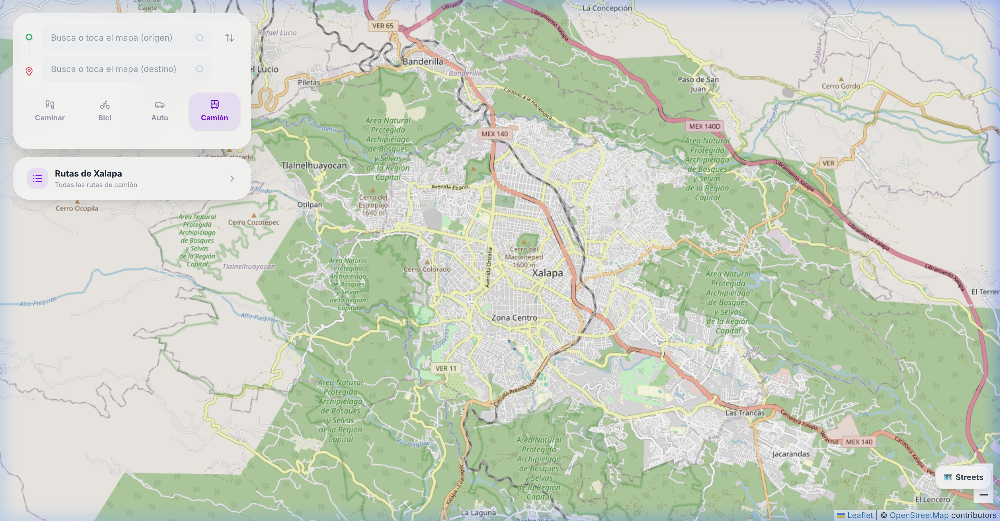
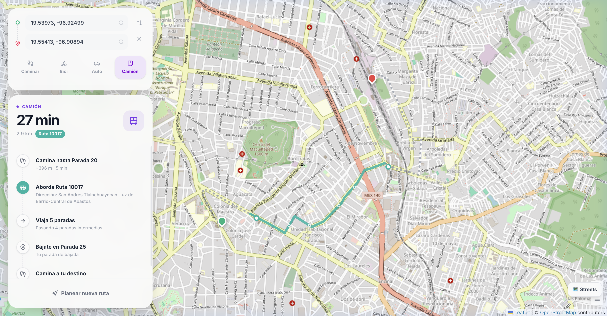
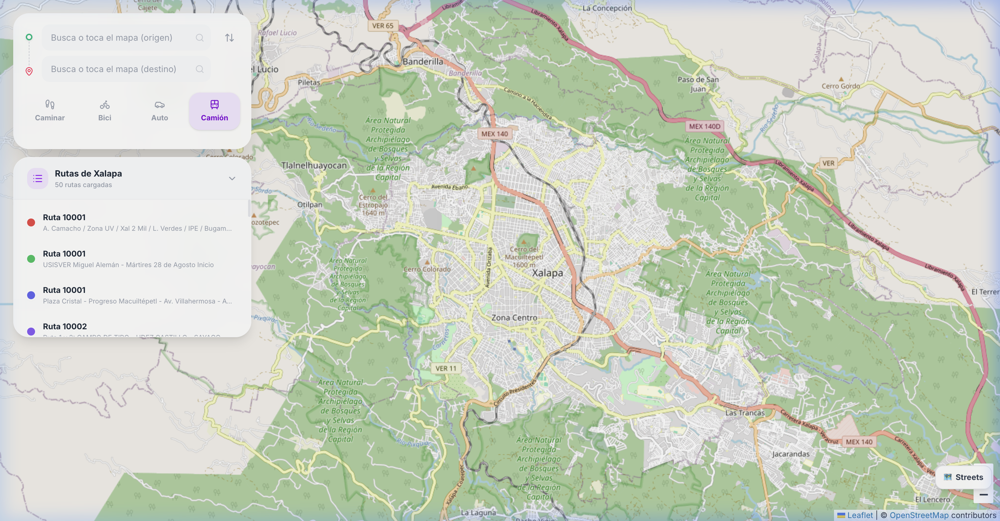
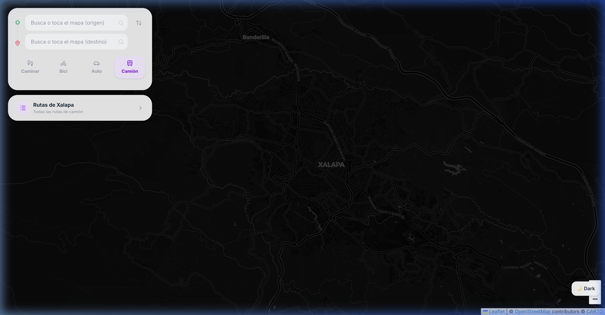

# 🚌 City-Transit Xalapa

**Planificador de rutas multimodal para Xalapa, Veracruz, México.**  
Encuentra la mejor ruta en camión, a pie, en bicicleta o en auto por la ciudad. Disponible en línea, sin instalar nada.

🌐 **[Ver la app en vivo →](https://sebastiancordoba.github.io/City-Transit/)**

---

## Capturas de pantalla

### Vista principal — Estilo calles (predeterminado)


### Ruta de camión con paradas intermedias


### Explorador de rutas — todas las líneas de Xalapa


### Modo oscuro


---

## Funcionalidades

| Función | Descripción |
|---|---|
| 🚌 **Rutas de camión** | Encuentra la ruta de camión más cercana a tu origen y destino |
| 🚶 **A pie** | Rutas peatonales con geometría real de calles (OSRM) |
| 🚲 **Bicicleta** | Rutas ciclistas con giro a giro |
| 🚗 **Auto** | Rutas en vehículo con indicaciones detalladas |
| 🔍 **Búsqueda de lugares** | Busca cualquier lugar en Xalapa por nombre (ej. "Parque Juárez", "UAV") |
| 🗺️ **Estilos de mapa** | Calles, Oscuro, Satélite, Topográfico y Claro |
| 📋 **Explorador de rutas** | Consulta todas las líneas de camión de la ciudad con su color |
| 📍 **Paradas visibles** | Cada parada intermedia se muestra como un pequeño círculo en el mapa |
| 📱 **Diseño responsivo** | Funciona en móvil como hoja deslizable desde abajo (estilo Google Maps) |

---

## Cómo usarla

1. Abre la app en tu navegador (móvil o escritorio)
2. **Toca el mapa** dos veces para marcar origen y destino — *o escribe el nombre de un lugar en los campos de búsqueda*
3. Selecciona el modo de transporte: **Caminar · Bici · Auto · Camión**
4. Presiona **"Buscar ruta"**
5. En móvil, desliza el panel inferior hacia arriba para ver las instrucciones completas

---

## Datos de rutas

Las rutas de camión de Xalapa provienen de **[Mapatón Ciudadano](https://mapaton.org/rutas/)**, un proyecto comunitario de cartografía participativa que digitaliza las rutas de transporte público de la ciudad. Los datos están en formato GeoJSON e incluyen geometría de trayecto y paradas.

> Agradecemos a todos los voluntarios de Mapatón por hacer posible este proyecto.

---

## Tecnologías

| Tecnología | Uso |
|---|---|
| [React](https://react.dev/) + [TypeScript](https://www.typescriptlang.org/) | Interfaz de usuario |
| [Vite](https://vitejs.dev/) | Empaquetador y servidor de desarrollo |
| [React Leaflet](https://react-leaflet.js.org/) | Renderizado del mapa |
| [Leaflet](https://leafletjs.com/) | Librería base de mapas |
| [OSRM](https://project-osrm.org/) | Cálculo de rutas peatonales, ciclistas y en auto |
| [Nominatim / OSM](https://nominatim.org/) | Geocodificación de lugares |
| [Motion](https://motion.dev/) | Animaciones fluidas |
| [Tailwind CSS](https://tailwindcss.com/) | Estilos |
| [Lucide React](https://lucide.dev/) | Iconos |
| CartoDB / Esri / OpenTopoMap | Estilos de mapa alternativos |

---

## Instalación local (desarrollo)

```bash
# Clonar el repositorio
git clone https://github.com/sebastiancordoba/City-Transit.git
cd City-Transit

# Instalar dependencias
npm install

# Generar el paquete de datos de rutas
npm run generate-data

# Iniciar el servidor de desarrollo
npm run dev
```

Abre [http://localhost:3000](http://localhost:3000) en tu navegador.

---

## Despliegue en GitHub Pages

El proyecto se despliega automáticamente con **GitHub Actions** al hacer push a `main`.  
El flujo de trabajo genera el archivo de datos, compila la app con Vite y la publica en la rama `gh-pages`.

También puedes generar el build manualmente:

```bash
npm run build   # genera /dist
```

---

## Licencia

MIT © [Sebastian Cordoba](https://github.com/sebastiancordoba)  
Datos de rutas: [Mapatón Ciudadano](https://mapaton.org/rutas/) · Licencia abierta
